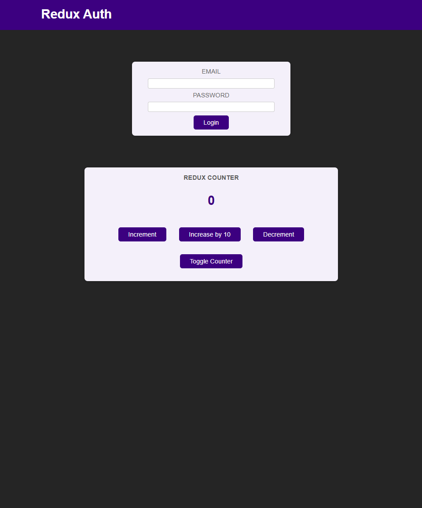

# React Redux Counter and Authentication App

A React app that demonstrates the usage of Redux for managing both authentication and counter state. It includes features for logging in, viewing a counter, and manipulating counter values (increment, decrement, increase by 10). The app uses Redux to handle the global state, making it scalable and maintainable. Users can log in, view a counter, and perform various actions on the counter, with the app managing these actions using Redux.
This project showcases the use of React with Redux, Redux Toolkit, and React hooks like useSelector and useDispatch to manage and update the app's state. It also demonstrates using Redux for user authentication, allowing users to toggle between viewing the counter and login screens.
<br><br>


## 🚀 Getting Started

### **Prerequisites**
Make sure you have the following installed before running the project:
- **Node.js** (Download from [nodejs.org](https://nodejs.org/))
- **npm** or **yarn** (Comes with Node.js)
<br>

### **Installation**
1. Clone this repository:
   ```sh
   git clone https://github.com/nathenpriyonggo/redux-basics
   ```
2. Navigate to the directory
   ```sh
   cd redux-basics
   ```
3. Install dependencies:
   ```sh
   npm install
   ```
4. Start the development server:
   ```sh
   npm run dev
   ```
5. Open ```http://localhost:5173/``` in your browser.
<br>

## 🛠️ Built With
- **React** - A JavaScript library for building user interfaces
- **Redux** – A state management library for JavaScript apps
- **Redux Toolkit** – Simplifies Redux setup and actions
- **React-Redux** – To connect React with Redux
- **Vite** – A fast build tool for modern web projects
<br>

## 🎮 App Features
- **Authentication** – Users can log in, and the app displays content based on authentication state.
- **Counter Functionality** – A simple counter with actions to increment, decrement, and increase by 10.
- **Global State Management** – The app uses Redux to manage the authentication state and counter state globally.
- **Toggle Counter** – Users can toggle the visibility of the counter.
- **Simple Login UI** – A basic login form that allows users to authenticate, using Redux to manage the authentication state.
<br>

## 🧩 How It Works
1. **Frontend**: React components handle rendering and UI logic, such as displaying the counter, managing login status, and updating the state via Redux.
- Redux: The app uses Redux for global state management, with counter and auth slices.
- useSelector and useDispatch: These hooks are used for reading the Redux state and dispatching actions, respectively.
2. Authentication: The auth slice of the Redux store manages user login status. When users log in, the state is updated to reflect authentication.
3. Counter: The counter slice manages the counter value. Users can increment, decrement, or increase the counter by 10.
<br>

## 📝 App Features
- **State Management with Redux**: Counter and authentication states are managed using Redux Toolkit.
- **Authentication Actions**: Login and logout actions are implemented using Redux actions and reducers.
- **Counter Actions**: The counter is updated through Redux actions such as increment, decrement, and toggle visibility.
<br>


## 🖥️ Preview
<p align="center"></p>
<br>

## 📜 License
This project is open-source. Feel free to fork, modify, and expand upon it!
<br><br>


---

✨ Happy coding! 🚀
